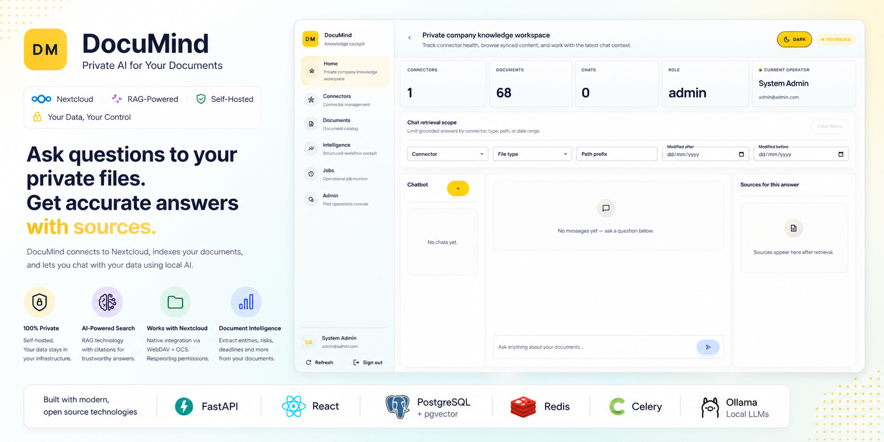
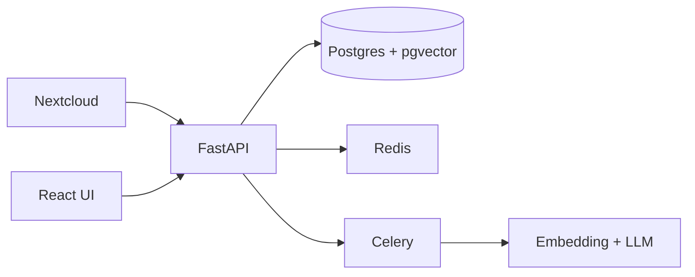

# 🚀 DocuMind

### Private AI for Your Documents (Nextcloud + RAG)

> Ask questions to your private files — get **accurate answers with sources**, fully self-hosted.

---


## ✨ Why DocuMind?

Most AI tools require uploading sensitive data to external APIs.

**DocuMind keeps everything local.**

* 🔐 100% private (self-hosted)
* 🧠 AI-powered search across documents
* 📎 Answers with **source citations**
* 🏢 Built for teams, companies, and power users

---


## 🎯 Who is this for?

- 🧑‍💻 Developers building RAG / AI systems
- 🏢 Companies with sensitive documents
- 🔐 Privacy-focused teams avoiding SaaS AI
- ☁️ Nextcloud users wanting AI search

---

## ⚡ Demo (What you get)

```text
Q: "What are the payment terms in our vendor contracts?"

→ Answer:
"Net 30 payment terms are defined in Section 4..."

Sources:
- /contracts/vendor_a.pdf (page 3)
- /contracts/vendor_b.pdf (page 2)
```

---

## 🧠 Core Features

* 🔎 Semantic search (RAG)
* 📄 Multi-format ingestion (PDF, DOCX, MD, TXT)
* 🔐 Permission-aware retrieval (Nextcloud ACLs)
* 🔄 Auto sync + reindex pipelines
* 🤖 Local LLM support (Ollama)
* 📊 Document intelligence (entities, risks, deadlines)
* 🧩 Nextcloud-native integration

Built on a scalable ingestion + classification pipeline

---

## 🏗️ Architecture (Simple)



---

## 🚀 Quick Start (1 command)

NextCloud bridge:
Copy nc_ai_bridge folder to Nextcloud extra apps folder(/var/snap/nextcloud/current/nextcloud/extra-apps/) to access app via icon on Nextcloud:

Docker:
```bash
make docker-dev
```
Local:
```bash
make local-dev
```


Then open:

* 🌐 App → [http://localhost:5173](http://localhost:5173)
* 📡 API → [http://localhost:8000/docs](http://localhost:8000/docs)
* ☁️ Nextcloud → [http://localhost:8081](http://localhost:8081)

**Login:**

Backend credentials (set in backend/.env):

```text
FIRST_SUPERUSER_EMAIL=admin@admin.com
FIRST_SUPERUSER_PASSWORD=12345678
```

---

## 🔄 How It Works

```text
Nextcloud → Sync → Parse → Chunk → Embed → Store → Query
```

Under the hood:

* ingestion pipeline
* classification engine
* RAG retrieval + citation builder

---

## 🔌 Integrations

* Nextcloud (WebDAV + OCS)
* Ollama (local LLMs)
* PostgreSQL + pgvector

---

## 🧪 Developer Friendly

```bash
make docker-dev
make docker-logs
make local-dev
make local-backend-test
```

Clean modular architecture:

* ingestion pipeline
* classification system
* AI layer isolation
* worker queues

---

## 🔐 Privacy First

* No external AI APIs required
* Runs fully local
* Respects document permissions
* Secure credential handling

---

## ⚠️ Limitations

* No OCR (yet)
* Limited file types
* Requires local model setup for best results

---

## ⭐ Why Star This Project?

* 🔥 Build your own **private ChatGPT for documents**
* 🧩 Plug into your existing Nextcloud instantly
* 🏗️ Production-ready architecture (not a toy demo)
* 🧠 Extendable AI pipelines (classification, workflows, agents)

---

## 🛣️ Roadmap

* [ ] OCR + image parsing
* [ ] Email ingestion (IMAP)
* [ ] Knowledge graph
* [ ] Multi-tenant SaaS mode
* [ ] Agent workflows

---

## 🤝 Contributing

PRs welcome. Open an issue first for major changes.

---

## 📄 License

MIT License — free for personal and commercial use.

---

## 💬 Final Note

DocuMind is not just another RAG demo.

It’s a **foundation for building private AI knowledge systems** on top of your existing infrastructure.