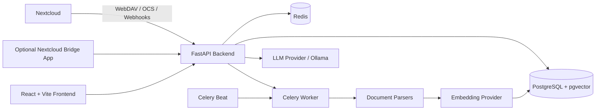

# DocuMind

**DocuMind** is a private, self-hosted AI workspace for Nextcloud documents. It syncs files from Nextcloud, parses and indexes document content, and lets users ask grounded questions with cited source snippets while respecting document permissions.

It is designed for individuals, teams, and companies that want AI-powered document search without moving confidential files into external SaaS platforms.

---

## Why Nextcloud?

[Nextcloud](https://nextcloud.com/) is an open-source, self-hosted file sharing and collaboration platform. It can be used as a private alternative to Google Drive, OneDrive, Dropbox, or Box.

For individuals, it offers private document storage, browser/mobile/desktop access, backups, sharing, and optional self-hosted control.

For companies, it helps with data sovereignty, confidentiality, user/group permissions, internal collaboration, and reduced dependency on third-party SaaS providers for sensitive business, legal, HR, financial, and technical documents.

---

## Why DocuMind?

Nextcloud stores documents, but finding precise answers inside large document collections can still be slow. DocuMind adds a private RAG layer on top of Nextcloud.

Key benefits:

- Ask natural-language questions over private Nextcloud files
- Receive answers grounded in cited source snippets
- Keep retrieval aligned with Nextcloud users, groups, owners, and public-link permissions
- Run with local/self-hosted AI providers such as Ollama
- Sync, parse, chunk, embed, reindex, and monitor documents through background jobs
- Provide an internal AI workspace without exposing company documents to external SaaS tools

---

## Features

- Local admin login and optional Nextcloud bridge login
- Cookie-based session authentication with CSRF protection
- Role-based access control for admin, operator, and viewer users
- Nextcloud connector management, credential testing, sync, and full reindex
- Document ingestion for PDF, DOCX, ODT, TXT, and Markdown
- ACL-aware document visibility based on Nextcloud permissions
- Grounded chat responses with saved sessions and cited source snippets
- Retrieval filters by connector, file type, path prefix, modified date, and active document scope
- Document browser with metadata, access lists, parse status, preview, and per-document reindex
- Celery/Redis background jobs with retries and document-level diagnostics
- Health checks, Prometheus-compatible metrics, request IDs, trace IDs, and optional Sentry reporting
- Ollama model readiness checks, model pulling, and warm-up when Ollama providers are enabled

---

## Architecture



---

## Tech Stack

**Backend**

- Python 3.12
- FastAPI
- SQLAlchemy + Alembic
- PostgreSQL + pgvector
- Celery + Redis
- Ollama
- pdfplumber, python-docx
- prometheus-client, sentry-sdk

**Frontend**

- React 19
- TypeScript
- Vite
- Material UI
- Tailwind CSS

**Integration**

- Nextcloud WebDAV API
- Nextcloud OCS API
- Optional Nextcloud app bridge
- Compatible with Nextcloud 31-32, depending on deployment configuration

---

## Quick Start

For a new starter, use the Docker flow first. It starts PostgreSQL, Redis, Ollama, backend, worker, scheduler, frontend, Nextcloud, and the Nextcloud database.

### Prerequisites

- Docker with Docker Compose v2
- GNU Make
- Internet access on first run so Ollama can pull models

For non-Docker local development you also need Python 3.12, Node.js/npm, Redis, PostgreSQL with pgvector, and Ollama installed on the host.

### Docker First Start

```bash
make docker-dev
```

`make docker-dev` creates env files if missing, runs database migrations in the Docker Postgres database, starts the Docker services, waits for health checks, and opens Nextcloud:

```text
http://localhost:8081/apps/dashboard/
```

Default Docker Nextcloud login:

```text
username: admin
password: admin
```

The backend admin account is created from `backend/.env`. With the default example env, use:

```text
email: admin@admin.com
password: 12345678
```

Useful local URLs:

- Frontend: <http://localhost:5173>
- Backend API: <http://localhost:8000>
- API docs: <http://localhost:8000/docs>
- Health: <http://localhost:8000/health>
- Nextcloud: <http://localhost:8081/apps/dashboard/>
- Ollama: <http://localhost:11434>

The first run can be slow. Docker uses Ollama bootstrap mode `ensure`, so missing models are pulled automatically:

```text
bge-m3:latest
llama3:latest
```

If you need to pull them manually:

```bash
docker compose exec ollama ollama pull bge-m3:latest
docker compose exec ollama ollama pull llama3:latest
```

---

## Local Development Commands

Docker commands:

```bash
make docker-dev
make docker-dev-rebuild
make docker-migrate
make docker-open-nextcloud
make docker-logs
make docker-ps
make docker-diagnose
make docker-down
```

Host-local commands:

```bash
make local-bootstrap
make local-dev
make local-backend-test
make local-frontend-lint
make local-frontend-build
make local-check
make local-seed-admin
```

To stop the Docker stack:

```bash
docker compose down
```

To stop and delete all Docker data volumes, including PostgreSQL data, Nextcloud files, and downloaded Ollama models:

```bash
docker compose down -v
```

---

## Configuration

Environment files are created from examples:

```bash
make docker-dev
```

Main files:

```text
.env
backend/.env
frontend/.env
```

Important backend values:

```env
DATABASE_URL=
REDIS_URL=
JWT_SECRET_KEY=
SETTINGS_VAULT_KEY=
FIRST_SUPERUSER_EMAIL=
FIRST_SUPERUSER_PASSWORD=
EMBEDDING_PROVIDER=
LLM_PROVIDER=
OLLAMA_BASE_URL=
OLLAMA_EMBEDDING_MODEL=
OLLAMA_CHAT_MODEL=
OLLAMA_BOOTSTRAP_MODE=
NEXTCLOUD_CONNECTOR_INTERNAL_BASE_URL=
NEXTCLOUD_BRIDGE_SHARED_SECRET=
NEXTCLOUD_WEBHOOK_SECRET=
```

Important frontend value:

```env
VITE_API_BASE_URL=
```

Replace all example secrets, passwords, tokens, and hostnames before any non-local deployment.

---

## Default Admin Account

The first local admin user is created from `backend/.env`:

```env
FIRST_SUPERUSER_EMAIL=
FIRST_SUPERUSER_PASSWORD=
```

With the default local example env:

```text
email: admin@admin.com
password: 12345678
```

Never commit real credentials.

---

## Supported Document Types

| Type | Status |
|---|---|
| PDF | Supported |
| DOCX | Supported |
| ODT | Supported |
| TXT | Supported |
| Markdown | Supported |
| Images / OCR | Not guaranteed unless implemented separately |
| Spreadsheets | Not listed as supported |
| Audio / Video | Not listed as supported |

---

## Basic Usage

1. Start the app:

```bash
make docker-dev
```

2. Sign in to Nextcloud:

```text
http://localhost:8081/apps/dashboard/
```

Default Docker Nextcloud credentials:

```text
username: admin
password: admin
```

3. Open the frontend if you want to use the AI workspace directly:

```text
http://localhost:5173
```

4. Sign in with the backend admin account from `backend/.env`.

5. Add a Nextcloud connector from the Connectors page:

- Display name
- Nextcloud base URL, for Docker usually `http://localhost:8081`
- Username
- App password
- Root path
- TLS verification preference

The backend container cannot call browser-local `localhost` directly. Docker sets `NEXTCLOUD_CONNECTOR_INTERNAL_BASE_URL=http://nextcloud`, so local Nextcloud connector URLs such as `http://localhost:8081` are rewritten internally for backend test and sync calls.

6. Use `Test`, `Sync`, or `Full reindex`.

7. Open the Documents page to inspect parsed files and indexing status.

8. Ask questions in the chat workspace and review cited source snippets.

---

## Nextcloud Plugin / Bridge App

The optional Nextcloud bridge app is located in:

```text
nc_ai_bridge/
```

It allows users to open the AI workspace from inside Nextcloud and exchange a short-lived signed token for backend session cookies.

### Install into Nextcloud `extra-apps`

Adjust paths for your server:

```bash
sudo cp -r /path/to/nextcloud_ai/nc_ai_bridge /path/to/nextcloud/extra-apps/
sudo chown -R root:root /path/to/nextcloud/extra-apps/nc_ai_bridge
```

If your installation uses `custom_apps` instead:

```bash
sudo cp -r /path/to/nextcloud_ai/nc_ai_bridge /path/to/nextcloud/custom_apps/
sudo chown -R root:root /path/to/nextcloud/custom_apps/nc_ai_bridge
```

> Some Nextcloud deployments expect app files to be readable by the web server user, often `www-data`. If the app does not appear or cannot be enabled, verify ownership and permissions for your deployment.

Enable the app:

```bash
sudo -u www-data php occ app:enable nc_ai_bridge
```

Configure bridge values:

```bash
sudo -u www-data php occ config:app:set nc_ai_bridge fastapi_base_url --value="<your-fastapi-base-url>"
sudo -u www-data php occ config:app:set nc_ai_bridge bridge_shared_secret --value="<same-value-as-NEXTCLOUD_BRIDGE_SHARED_SECRET>"
sudo -u www-data php occ config:app:set nc_ai_bridge bridge_issuer --value="nextcloud-bridge"
sudo -u www-data php occ config:app:set nc_ai_bridge bridge_audience --value="fastapi-nextcloud"
sudo -u www-data php occ config:app:set nc_ai_bridge bridge_ttl_seconds --value="60"
```

Also verify the Nextcloud base URL in `config/config.php`:

```php
'overwrite.cli.url' => '<your-nextcloud-base-url>',
```

---

## API Documentation

When the backend is running:

- Swagger UI: <http://localhost:8000/docs>
- ReDoc: <http://localhost:8000/redoc>
- Health: <http://localhost:8000/health>
- Liveness: <http://localhost:8000/api/v1/health/live>
- Readiness: <http://localhost:8000/api/v1/health/ready>

---

## Deployment

Production deployment files live in:

```text
deployment/
```

Typical production bootstrap:

```bash
cp .env.example .env
cp backend/.env.example backend/.env
make deploy-config
make deploy-up
```

The deployment package may include Caddy TLS reverse proxying, persistent PostgreSQL/Redis/Ollama volumes, static frontend serving, backend worker and scheduler services, metrics, backup scripts, restore scripts, and operations runbooks.

See:

```text
deployment/README.md
deployment/OPERATIONS.md
```

---

## Testing and Quality Checks

```bash
make local-backend-test
make local-frontend-lint
make local-frontend-build
make local-check
```

---

## Repository Structure

```text
.
├── .env.example
├── Makefile
├── backend/
│   ├── ai/
│   ├── alembic/
│   ├── api/
│   ├── connectors/nextcloud/
│   ├── core/
│   ├── db/
│   ├── ingestion/
│   ├── parsers/
│   ├── scripts/
│   ├── services/
│   ├── tests/
│   ├── workers/
│   ├── Dockerfile
│   ├── .env.example
│   └── pyproject.toml
├── deployment/
├── frontend/
│   ├── src/
│   ├── Dockerfile
│   ├── .env.example
│   └── package.json
├── nc_ai_bridge/
└── docker-compose.yml
```

---

## Security Notes

- Use Nextcloud app passwords for connector access, not browser passwords.
- Replace all local/demo secrets before deployment.
- Use HTTPS in production.
- Configure secure auth cookies in production.
- Keep `NEXTCLOUD_BRIDGE_SHARED_SECRET`, `JWT_SECRET_KEY`, and `SETTINGS_VAULT_KEY` private.
- Restrict admin access to trusted users only.

---

## Troubleshooting

### Readiness endpoint returns `503`

Run:

```bash
curl http://localhost:8000/api/v1/health/ready
```

The response should show whether the database, Redis, broker, or Ollama runtime is unhealthy.

### Nextcloud connector authentication fails

Use a Nextcloud username and app password.

### Nextcloud connector cannot reach localhost

In Docker, `localhost` inside the backend container means the backend container, not the host browser. Use this browser-facing connector URL for the bundled Docker Nextcloud:

```text
http://localhost:8081
```

Docker sets this backend-only internal URL:

```env
NEXTCLOUD_CONNECTOR_INTERNAL_BASE_URL=http://nextcloud
```

That lets backend connector test and sync calls reach the Docker Nextcloud service.

### Ollama says a model was not found

Docker should pull missing models automatically on startup. To pull manually:

```bash
docker compose exec ollama ollama pull bge-m3:latest
docker compose exec ollama ollama pull llama3:latest
```

Then restart backend and worker:

```bash
docker compose restart backend worker
```

### Migration container failed

Inspect the migration logs:

```bash
docker compose logs --tail=160 migrate postgres
```

Run the Docker migration step explicitly:

```bash
make docker-migrate
```

### Docker permission denied on `/var/run/docker.sock`

Your user may not have permission to use Docker. On Linux, either run Docker commands with the required privileges or add your user to the Docker group according to your distro's Docker installation guide.

### Documents are not indexed

Verify the file type is supported and check worker logs, parse status, and document-level failure diagnostics.

### Ollama startup is slow

The first run can be slow because required models may be pulled and warmed automatically.

### Nextcloud bridge does not work

Verify:

```env
NEXTCLOUD_BRIDGE_SHARED_SECRET=
```

and:

```php
'overwrite.cli.url' => '<your-nextcloud-base-url>',
```

---

## Known Limitations

- Only selected document formats are currently parsed.
- OCR/image extraction is not guaranteed unless implemented separately.
- Spreadsheet, audio, and video parsing are not listed as supported.
- Frontend tests may not be configured.
- Repository-wide licensing should be clarified if no root `LICENSE` file exists.
- Production secrets must be replaced before deployment.

---

## License

If no root `LICENSE` file is present, repository-wide licensing needs clarification.

If the only explicit license declaration is inside `nc_ai_bridge/composer.json`, that license applies to the bridge package and does not necessarily establish a repository-wide license by itself.
